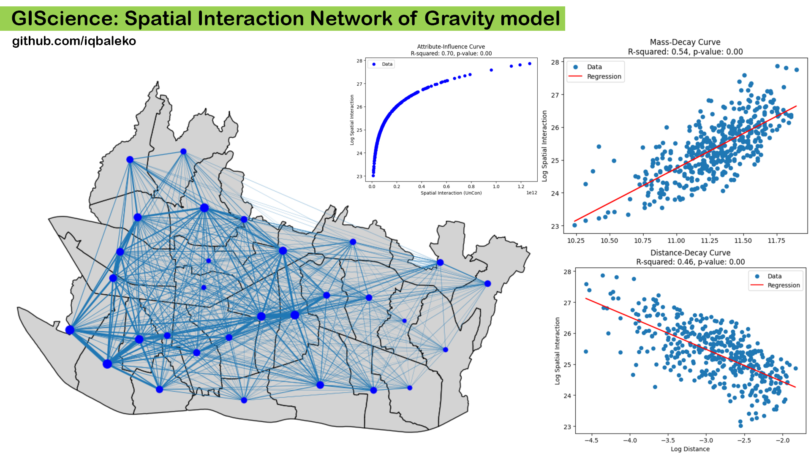

# GIScience: Spatial Interaction Network of Gravity model

This code was created to to construct spatial interaction network using Gravity Model approach

The main file can be found in this repository "Visualizing_3D_terrain_with_cloud_data.ipynb"
Go to the Google colab file to preview the 3D interactive terrain visual

Yes, you can use this code for any purpose like scientific research
Yes, you can modify this code as save file
