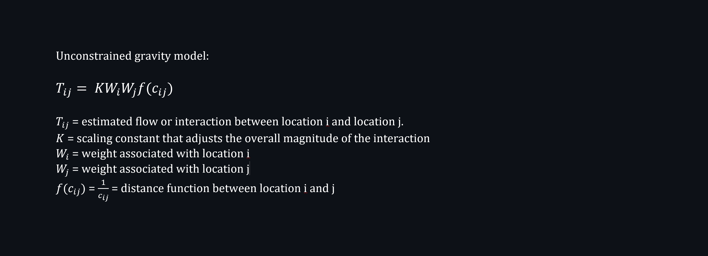

# GIScience: Spatial Interaction Network of Gravity model

This code was created to to construct spatial interaction network using Gravity Model approach. The specific gravity approach were used is the unconstrained gravity model or as known as clasical gravity model. 

Progses : In the current time, the production constrained, attraction constrained, and production-attraction constrained gravity model were under developed and will be updated to this repository.

The main file can be found in this repository "GIScience_Gravity_model_spatial_interaction_network.ipynb" for a code

Input :
- Polygon Shapefile of administrative data which include attribute/column that define weight (Population attribute is the example)

Output :
- Point feature of administrative unit in shapefile point
- Spatial interaction network in shapefile polyline
- Mass-decay curve
- Distance-decay curve
- Attribute influence curve
- Full statistic details of regression in table (as a print)

Yes, you can use this code for any purpose like scientific research
Yes, you can modify this code as save file
